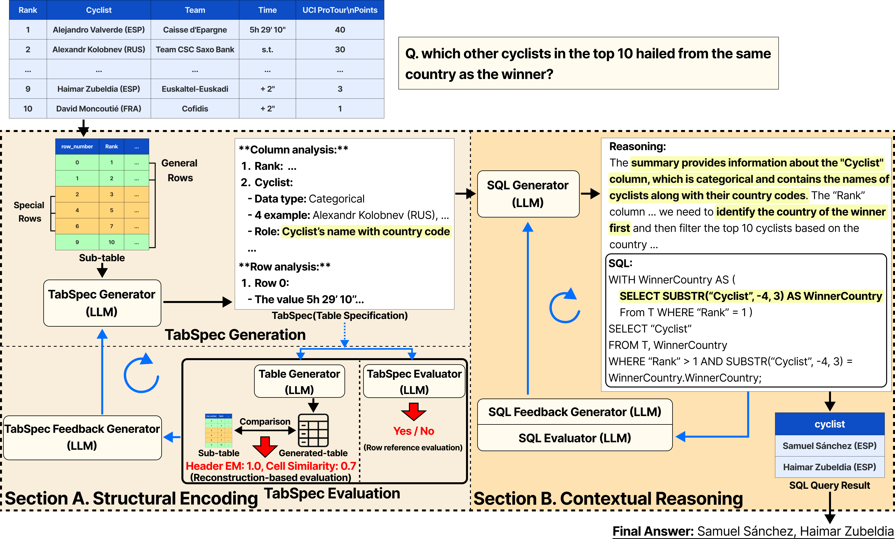

# TabBridge: Bridging Structure and Context for Accurate Table Reasoning

## Abstract
> Table reasoning remains challenging for Large Language Models (LLMs) as it requires integrating structured tabular information with natural language questions. Previous SQL-based approaches improve table reasoning through Text-to-SQL generation but still rely on surface alignment between question keywords and column headers. As a result, they often misinterpret expressions and generate queries with spurious or missing column mappings. Normalization strategies intended to enhance consistency often distort structural information by over processing or removing significant rows and columns such as subtotals.
> We introduce TabBridge, a framework that incorporates both textual and contextual information for accurate table reasoning. TabBridge generates a unified textual representation called Table Specification (TabSpec), preserving the structural information through row and column analysis. To ensure accuracy and consistency, we also employ a Reconstruction-based evaluation mechanism to verify and refine the generated TabSpec. The refined TabSpec is then used to generate SQL queries that align with the contextual intent of the question, effectively capturing relevant column semantics often overlooked by previous approaches.
> Across three public benchmarks, TabBridge consistently outperforms previous SQL-based methods, achieving 73.94\% accuracy on WikiTableQuestions (+5.3 pp over the previous state of the art) and demonstrating improved semantic consistency in free-form reasoning.

## Method Overview

Our research focuses on improving LLM reasoning and QA performance over table data through:



## Installation & Setup

### 1. Environment Setup

```bash
# Create virtual environment (Python 3.9 recommended)
python3.9 -m venv env

# Install dependencies
pip install -r requirements.txt
```

### 2. API Configuration

Create a `.env` file in the project root:

```bash
OPENAI_API_KEY=your_openai_api_key_here
```

## Execution

```bash
python run_tabbridge.py
```

## Project Structure

```
TabBridge/
├── 📁 datasets/     # Dataset files
│   ├── wtq.jsonl    # WikiTableQuestions dataset (main)
│   └── wtq.json     # Alternative format
├── 📁 prompt/                                 # All prompt templates
│   ├── TabSpec_Generation.txt                  # Table Specification generation
│   ├── SQL_Reasoning.txt                       # SQL query generation
│   ├── TabSpec_row_analysis_evaluation.txt     # Direct TabSpec evaluation
│   ├── SQL_Evaluation.txt                      # SQL quality assessment
│   ├── 📁 TabSpec_feedback/         # TabSpec refinement prompts
│   │   ├── row_analysis_feedback.txt
│   │   ├── header_feedback.txt
│   │   └── structure_feedback.txt
│   ├── 📁 SQL_feedback/             # SQL refinement prompts
│   │   ├── appropriate_role.txt
│   │   ├── well_used_row_analysis.txt
│   │   ├── appropriate_data_type.txt
│   │   └── faithfulness.txt
│   └── 📁 Table_Generation/         # Table reconstruction prompts
│       ├── Schema_Extraction.txt
│       ├── Instruction_Extraction.txt
│       └── Table_Generation.txt
├── 📁 utils/                                       # Core utility modules
│   ├── preprocess.py                               # Data preprocessing utilities
│   ├── prompt_wtq.py                               # Prompt loading and management
│   ├── tabspec_row_analysis_evaluator.py           # Direct TabSpec evaluation
│   ├── tabspec_reconstruction_based_evaluator.py   # Reconstruction-based TabSpec evaluation
│   └── sql_evaluator.py                            # SQL quality evaluation
├── 📁 outputs/                   # Generated results (auto-created)
│   ├── 📁 subtables/             # Cached sub-table extractions
│   ├── 📁 tabspec_logs/          # TabSpec generation & evaluation logs
│   ├── 📁 sql_logs/              # SQL generation & execution logs
│   ├── wtq_results.jsonl         # Final results (JSON format)
│   └── wtq_results.csv           # Final results (CSV format)
├── run_tabbridge.py              # Main execution script
├── subtable_extractor_euclid.py  # Sub-table extraction logic
└── requirements.txt              # Python dependencies
```